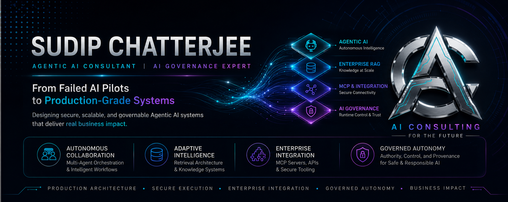

  

  
  
  
  
  

  
  
  

I design and advise on production-grade Agentic AI systems that can reason, retrieve, coordinate agents, call tools, and operate safely under real business constraints.

My work spans enterprise RAG, multi-agent orchestration, MCP-based integration, open-weight models, evaluation, and runtime AI governance—helping organizations move from fragile pilots to scalable, reliable, and governable systems.

  <strong> Architecture · Orchestration · Integration · Governance · Production Readiness</strong>

---

## Verified Contribution

### Authority Freshness for Runtime Trust

Contributed to the Vouch Protocol implementation of **authority freshness** for runtime trust decisions.

The contribution introduced the principle that authority should not be treated as permanently valid after it is granted. Runtime admissibility should consider:

- elapsed time since authority was established;
- changes in authority state;
- the consequence level of the proposed action.

This helps prevent stale permissions from being treated as valid during high-impact execution.

**References**

- [Signed Contributor Credential](https://vouch-protocol.com/c/aiconsulting4future/375)
- [Vouch Protocol Pull Request #375](https://github.com/vouch-protocol/vouch/pull/375)

---

## Consulting & Technical Expertise

### Agentic AI & Enterprise Architecture

Design of production-grade AI systems capable of reasoning, retrieving information, coordinating specialized agents, invoking tools, and operating under explicit control boundaries.

**Focus areas:** LangGraph workflows, stateful orchestration, tool execution, human-in-the-loop controls, failure handling, scalability, reliability, security, observability, cost control, and production readiness.

### Enterprise RAG

Architecture and optimization of retrieval systems for enterprise knowledge, including ingestion, chunking, embeddings, retrieval, reranking, grounded generation, evaluation, and observability.

**Focus areas:** large-scale knowledge bases, retrieval quality, latency reduction, hallucination control, reliable source grounding, and knowledge-system performance.

### MCP & Enterprise Integration

Design of MCP servers and secure tool interfaces that connect AI agents with enterprise applications, APIs, databases, and operational systems.

**Focus areas:** structured function calling, permission boundaries, API orchestration, tool contracts, secure connectivity, and auditable system integration.

### AI Governance

Design of runtime governance controls for consequential AI actions.

**Focus areas:** capability validation, authority freshness, runtime admissibility, policy enforcement, pre-execution gates, escalation, provenance, accountability, and auditability.

### Open-Weight Models & Domain Adaptation

Evaluation and adaptation of open-weight LLMs and SLMs for enterprise and domain-specific use cases.

**Focus areas:** model selection, fine-tuning, RLHF, synthetic data generation, evaluation, deployment trade-offs, performance optimization, and sovereign AI considerations.

---

## Writing & Research

I publish original thinking on Agentic AI, runtime governance, enterprise architecture, and the design of production-grade autonomous systems.

### Featured Series: Governing Enterprise AI Agents

- [The Most Dangerous AI Hallucination Isn’t an Answer. It’s an Action.](https://lnkd.in/p/d3WKXx78)
- [A Perfectly Valid AI Action Can Still Be Unauthorized.](https://lnkd.in/p/dMcsAuPQ)
- [The Agentic AI Control Plane.](https://lnkd.in/p/d2FcPw3w)
- [A Multi-Agent System Can Produce the Correct Answer and Still Fail Governance.](https://lnkd.in/p/dE7jw_we)

[More on LinkedIn](https://www.linkedin.com/in/sudip-consulting/) ·
[More on Medium](https://medium.com/@sc-blogs)

---

## Selected Outcomes

- Designed a four-agent contract review system that reduced analyst review time by **70%**.
- Architected an enterprise RAG pipeline for a **500,000-document knowledge base**, reducing query latency from **8 seconds to under 1.2 seconds**.
- Fine-tuned a domain-specific SLM for financial compliance, reducing hallucination rates by approximately **60%** compared with the base model.
- Built MCP-based tool-calling infrastructure connecting AI agents with **six enterprise systems**.

---

## Consulting & Collaboration

I work with founders, product teams, and enterprise leaders who need to move AI systems from prototype to production.

Typical engagements include:

- Agentic AI architecture and production-readiness reviews
- Enterprise RAG design and retrieval-quality improvement
- Multi-agent workflow design using LangGraph
- MCP server and tool-integration architecture
- AI governance, runtime controls, and execution safety
- Open-weight model evaluation and domain adaptation

For consulting discussions, architecture reviews, or professional collaboration:

  

 

  <strong>Building AI systems that are not only intelligent, but reliable, governable, and ready for production.</strong>

